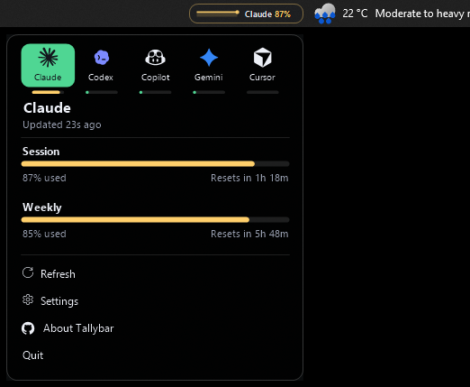

# Tallybar

A live, glassy AI-usage gauge drawn directly onto your Windows taskbar.

Tallybar renders a small strip next to the clock showing how much of your AI
coding-plan quota is left — a live sparkline, the current session percentage, and a
countdown to the next reset. No window to open, no tab to check: the number you care
about is just always there.

Supported providers: **Claude**, **Codex** (OpenAI), **Copilot**, **Gemini**, and
**Cursor** — each read from the session that provider's own CLI or app already keeps
on your machine.


<p align="center">
  
</p>

## Why on the taskbar?

Tray icons are 16 pixels of guesswork. Network monitors solved this decades ago by
drawing straight onto the taskbar — Tallybar does the same for AI usage limits, so you
can plan a long agent run around your reset window at a glance.

- **Live sparkline** of recent usage, colored by state: green → amber → red as the
  window fills (thresholds and colors are yours to change).
- **Reset countdown** (`↻ 3h42m`) plus the weekly window percentage; cycles between
  providers (Claude, Codex) or pins the one you pick.
- **Click for detail**: an acrylic popover with every usage window per provider —
  bars, percentages, and reset countdowns.
- **Blends in**: per-pixel-alpha rendering over the taskbar's own material, light/dark
  theme aware, hides automatically over fullscreen apps.
- **Drag to place, drag edges to resize**: slide the strip anywhere along the taskbar
  and pull its left/top edge to size it; both stick across restarts.
- **Customizable**: which items show, colors, thresholds, corner radius, opacity,
  animation style (pulse / gradient / rainbow), poll interval, launch at login,
  secondary-monitor strips — all in a live-preview settings flyout.
- **Tray mini-gauge**: the notification-area icon renders live usage bars, so the
  numbers survive even where the overlay can't attach.

## Privacy

Tallybar has no backend and no telemetry. It reuses the sessions your tools already
maintain locally and sends each token only to that vendor's own usage endpoint,
storing nothing of its own:

| Provider | Source |
|----------|--------|
| Claude | `~/.claude/.credentials.json` (Claude Code OAuth) |
| Codex | `~/.codex/auth.json` (codex CLI) |
| Copilot | `gh auth token` (GitHub CLI) |
| Gemini | `~/.gemini/oauth_creds.json` (gemini CLI; refreshed in place) |
| Cursor | `%APPDATA%\Cursor\…\state.vscdb` (Cursor app, read-only) |

A provider simply shows "not configured" until its CLI/app is signed in. If a token has
expired, run that tool once to refresh it.

## Getting started

Requires Windows 10 (1809+) or Windows 11, and the [.NET 10 SDK](https://dotnet.microsoft.com/download) to build.

```bash
git clone https://github.com/Riyoway/Tallybar
cd Tallybar
dotnet run --project src/Tallybar.Strip
```

The strip appears just left of the clock after the first fetch (a few seconds).

`scripts/dev.ps1` is a convenience wrapper — it stops any running instance (which
otherwise locks the exe), builds, and launches. `scripts/dev.ps1 -Probe` instead prints
each provider's usage to the console, handy for checking credentials without the UI.

| Action | Effect |
|--------|--------|
| Click the strip (or tray icon) | Open the usage popover |
| Drag the strip | Move it along the taskbar (persisted) |
| Drag its left or top edge | Resize width / height (persisted) |
| Right-click the tray icon | Open · Settings · Refresh · Reset · Exit |
| `Tallybar --probe` | Print fetched usage to the console, no UI |

Settings (tray icon → **Settings…**) cover providers, displayed items, theme, colors
and thresholds, corner radius, opacity, animations, poll interval, launch at login,
and strips on secondary taskbars. Changes apply live.

## How it works

Windows 11 removed deskbands, so nothing can truly dock into the taskbar anymore.
Tallybar instead keeps a borderless, per-pixel-alpha layered window glued over the
taskbar surface:

- Anchors to `Shell_TrayWnd` / `TrayNotifyWnd` (stable on both Win10 and Win11,
  regardless of icon alignment) and repositions via a `SetWinEventHook` on the tray
  plus `WM_DISPLAYCHANGE` / `WM_DPICHANGED` / `WM_SETTINGCHANGE`.
- Re-attaches on the `TaskbarCreated` broadcast, so it survives Explorer restarts.
- Per-Monitor-V2 DPI aware; hides when `SHQueryUserNotificationState` reports a
  fullscreen app, mirroring the taskbar's own behavior.
- Usage is polled every 60 s with exponential backoff (to 30 min) on failure; the
  strip renders from a ring buffer and never blocks on the network. Failures keep the
  last known values on screen, marked stale — never a spinner on your taskbar.

## Limitations

- Horizontal (bottom/top) taskbars only; vertical taskbars are not handled yet.
  Packaged, signed releases and more providers are on the roadmap.
- The overlay shares space with the tray area rather than reserving it — if it covers
  an icon, drag it somewhere emptier.

## License

MIT — see [LICENSE](LICENSE).
